# Factory Sequence Diagrams - Layered Two-Line Style

Moi participant co hai dong: stereotype o dong dau va ten lop/interface o dong sau. Sao chep tung khoi `@startuml` den `@enduml` vao Visual Paradigm.

## 3.2.5.1 Hoan thien ho so nha may

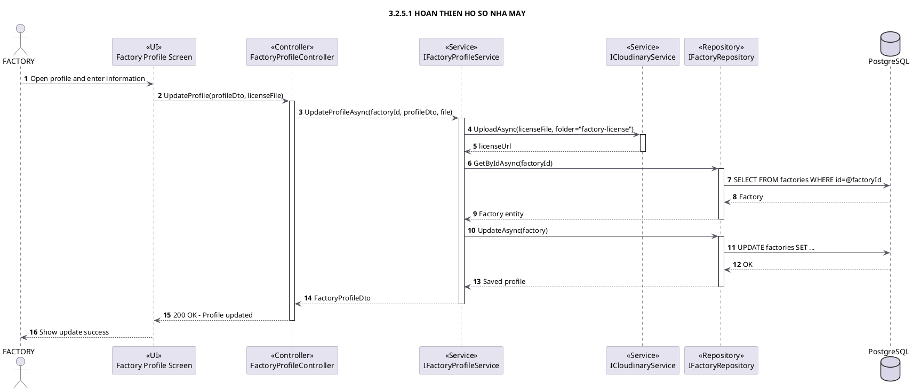

## 3.2.5.2 Xem dashboard nha may

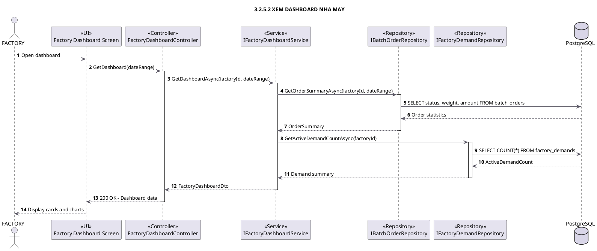

## 3.2.5.3 Dang va quan ly nhu cau thu mua

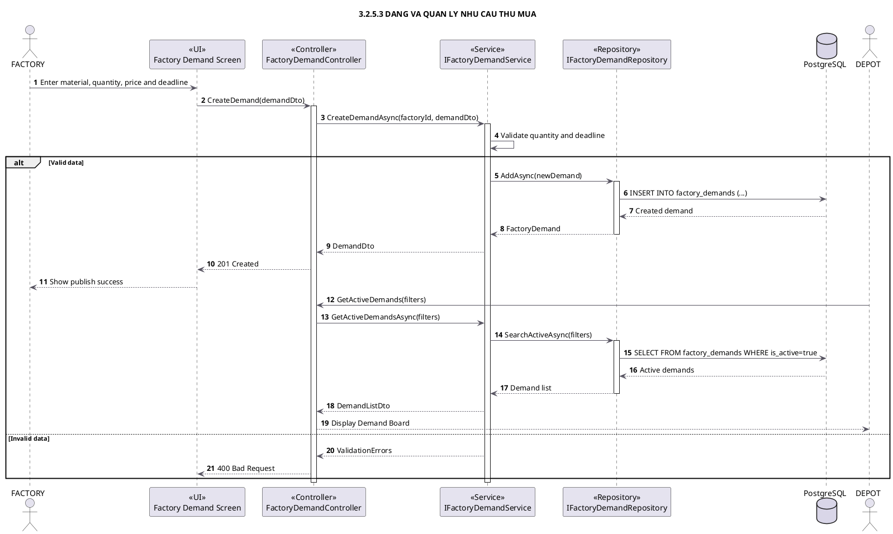

## 3.2.5.4 Duyet va nhan lo tren Marketplace

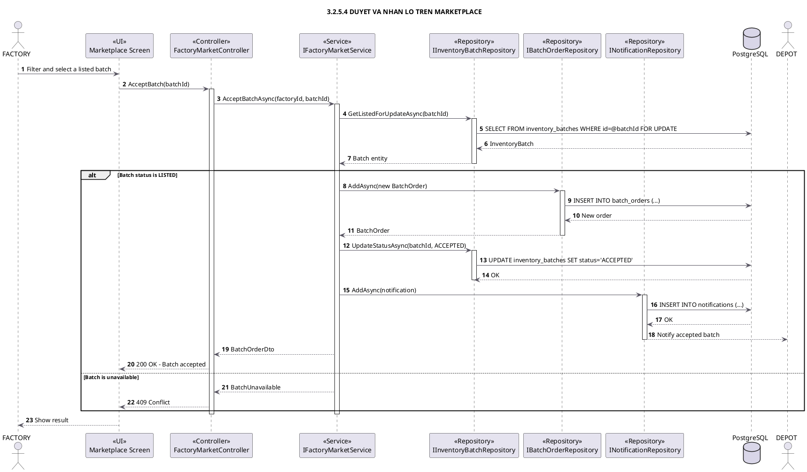

## 3.2.5.5 Duyet request chi dinh tu Depot

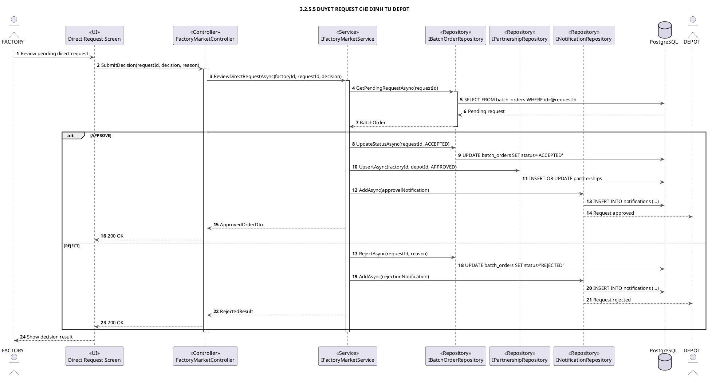

## 3.2.5.6 Theo doi van chuyen

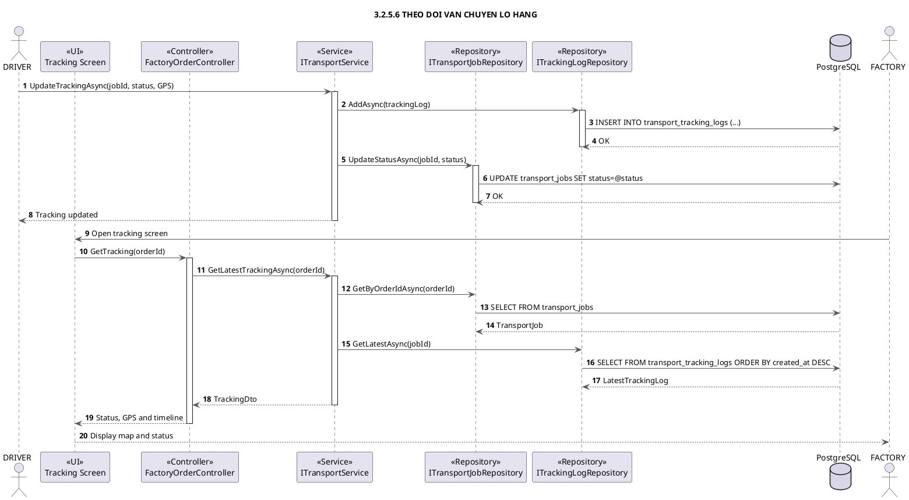

## 3.2.5.7 Xac nhan nhan hang

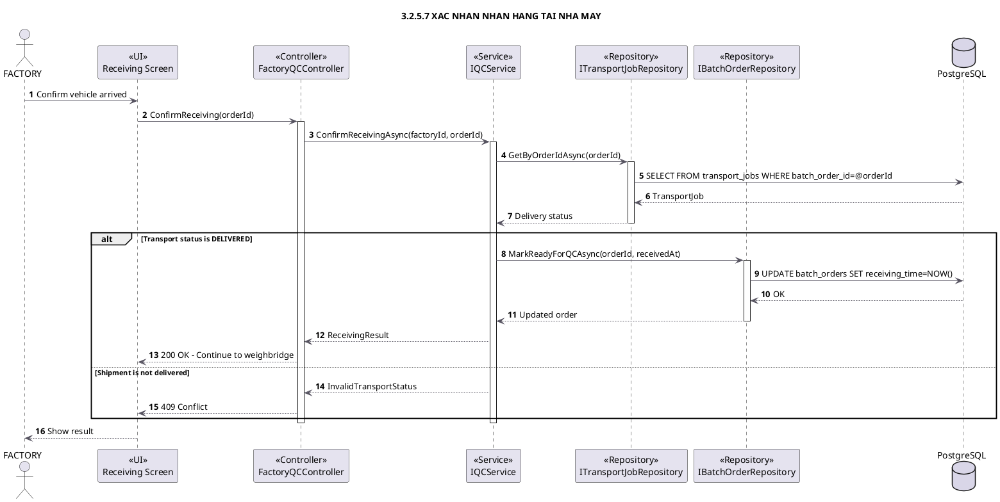

## 3.2.5.8 Can doi trong

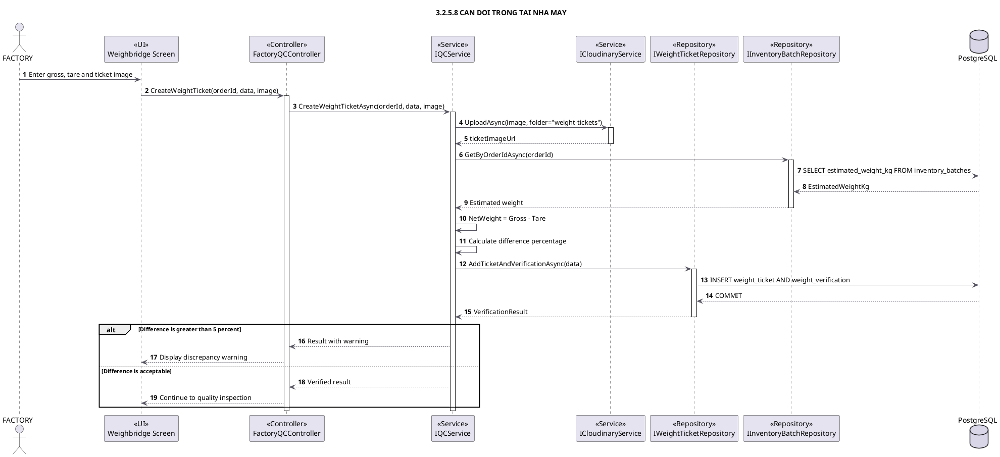

## 3.2.5.9 Kiem tra chat luong

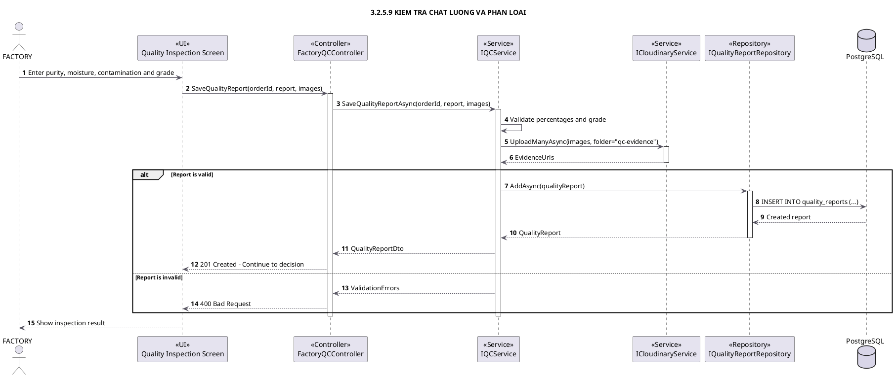

## 3.2.5.10 Chap nhan hoac tu choi lo

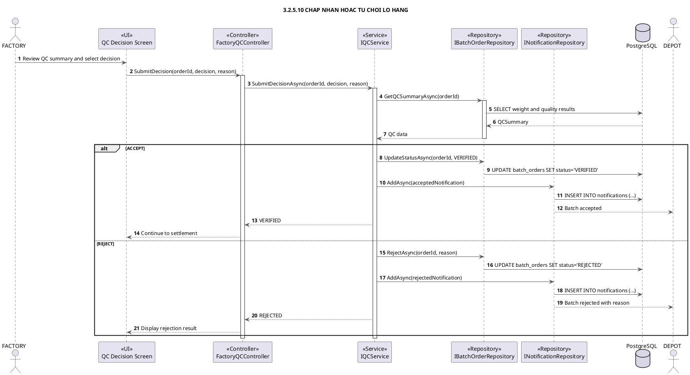

## 3.2.5.11 Quyet toan va upload hoa don

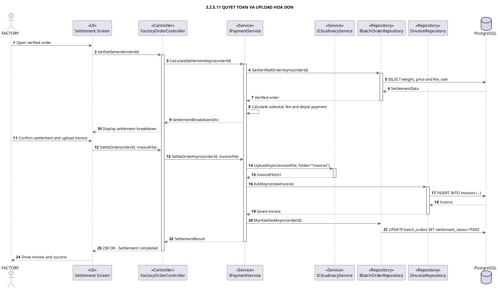

## 3.2.5.12 Danh gia va quan ly doi tac Depot

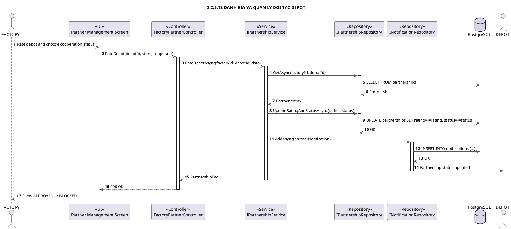

## 3.2.5.13 Xem va tao chung nhan EPR

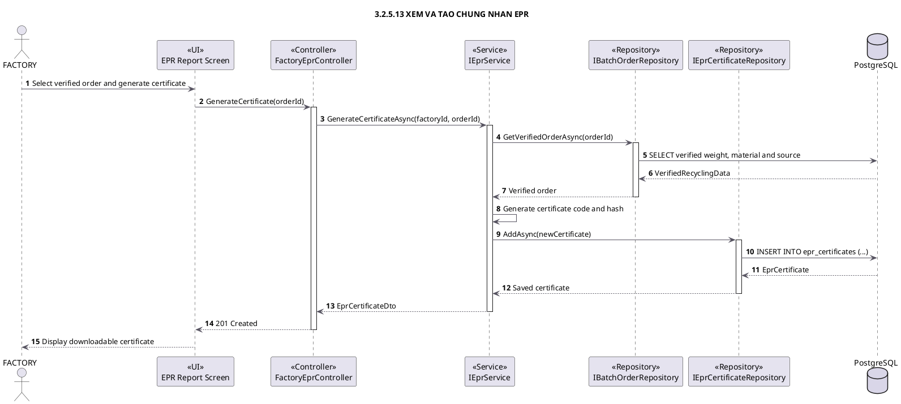
