# Factory Sequence Diagrams - Member 4

Copy one PlantUML block at a time into Visual Paradigm AI Diagram Generation and select **Sequence Diagram**.

## 3.2.5.1 Complete Factory Profile

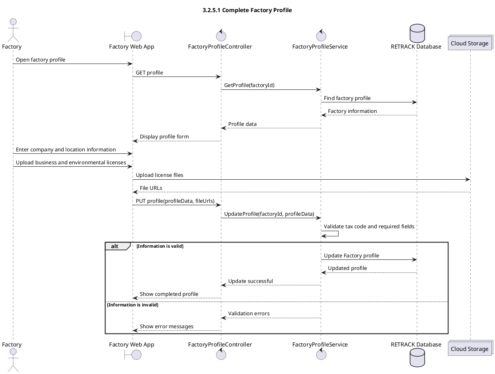

## 3.2.5.2 View Factory Dashboard

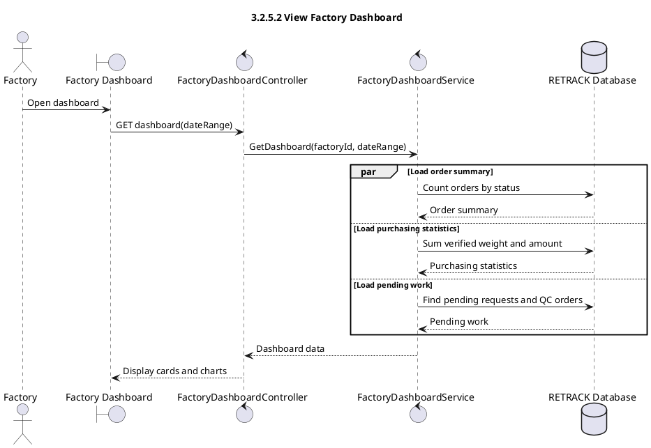

## 3.2.5.3 Publish and Manage Purchasing Demand

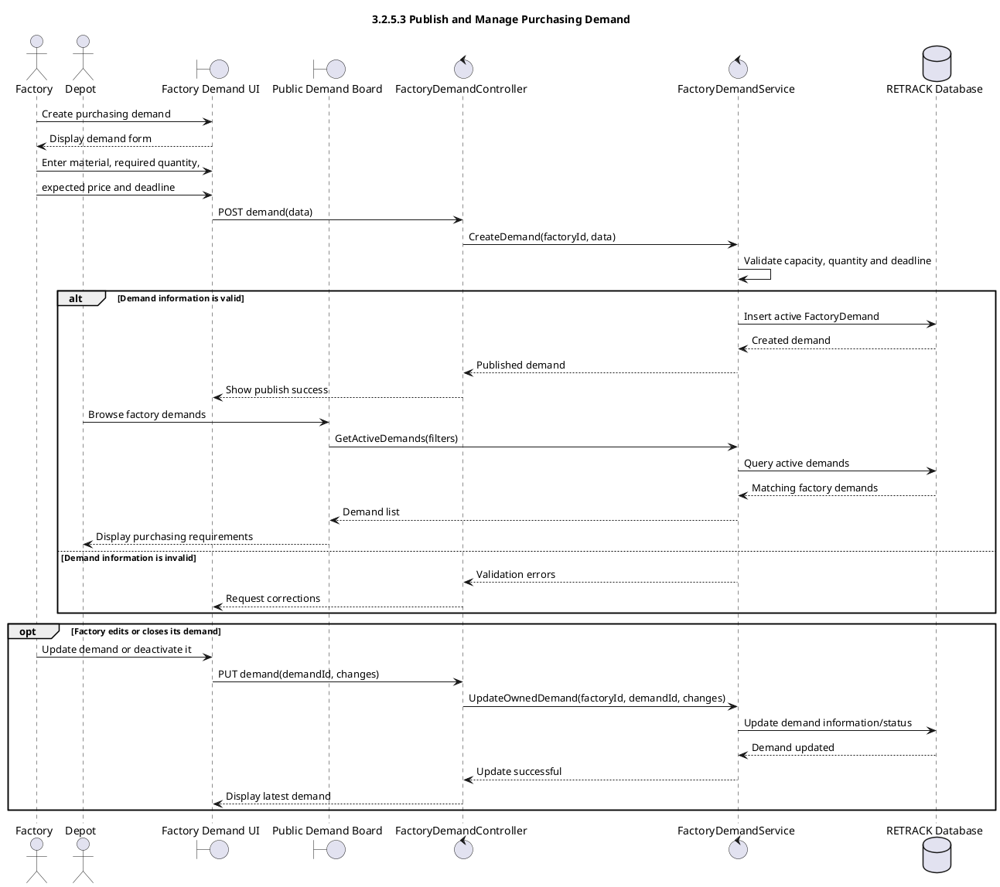

## 3.2.5.4 Browse and Accept Marketplace Batch

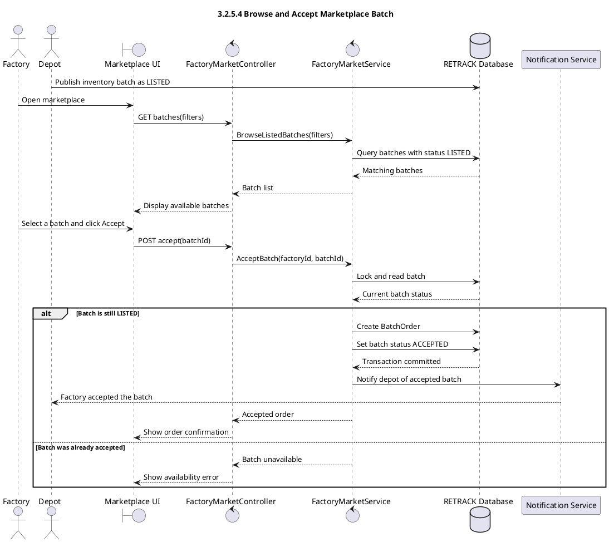

## 3.2.5.5 Approve or Reject Direct Request

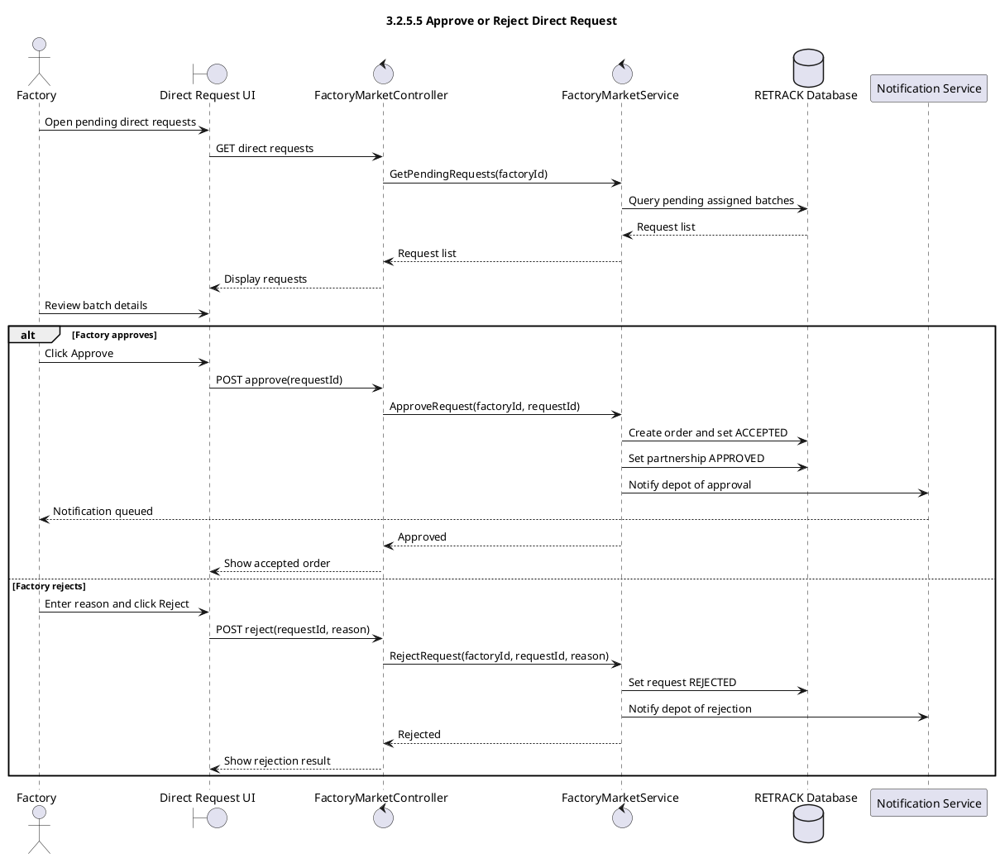

## 3.2.5.6 Track Batch Transportation

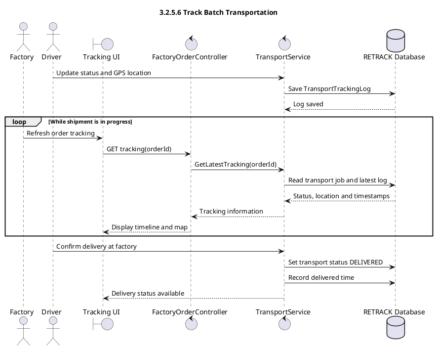

## 3.2.5.7 Confirm Batch Receiving

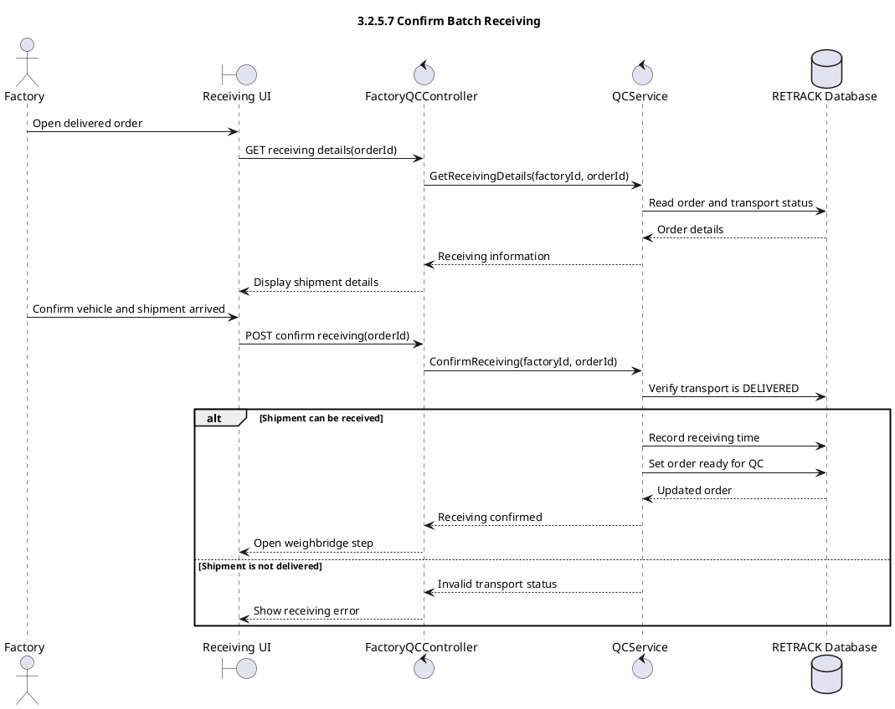

## 3.2.5.8 Perform Weighbridge Verification

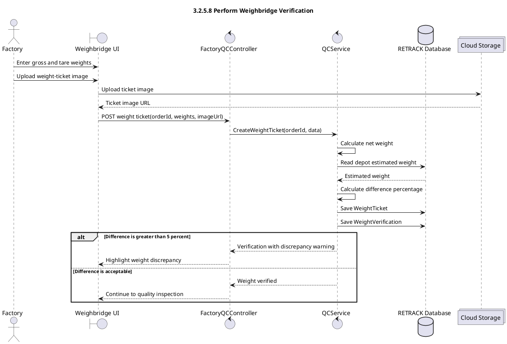

## 3.2.5.9 Perform Quality Inspection

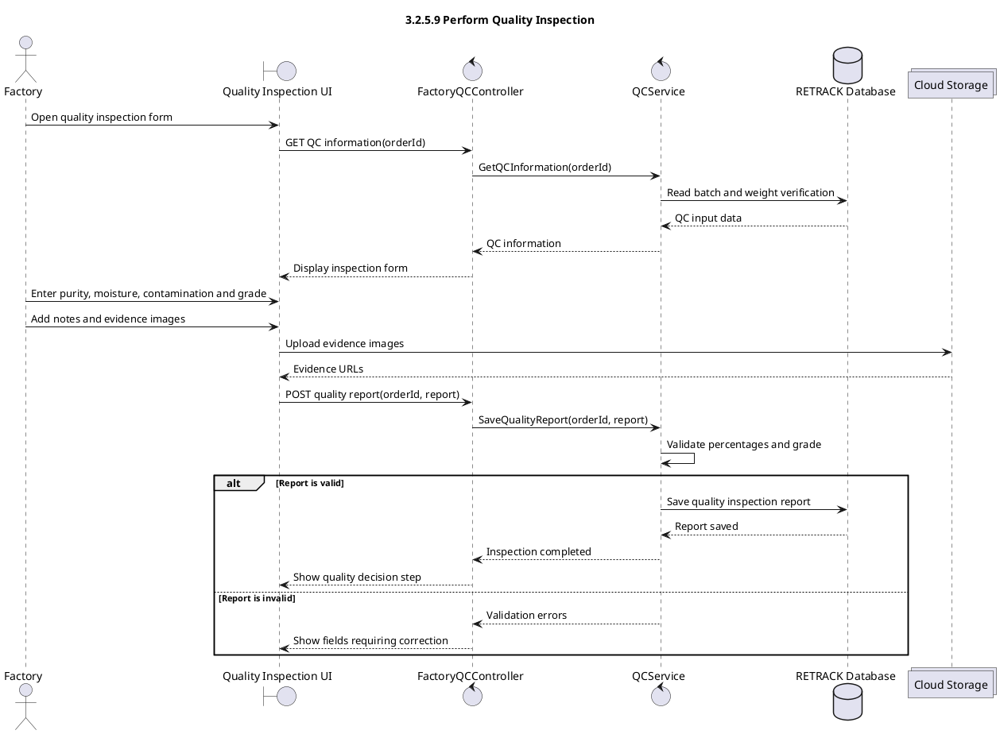

## 3.2.5.10 Accept or Reject Batch

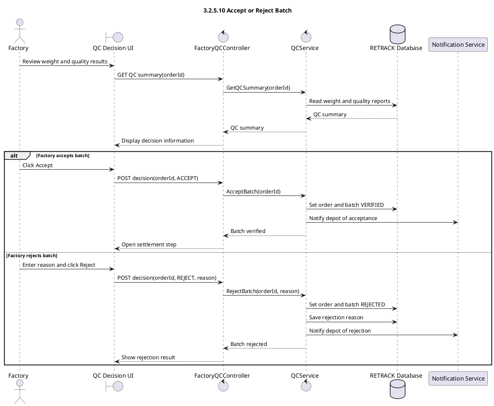

## 3.2.5.11 Settle Batch Order and Upload Invoice

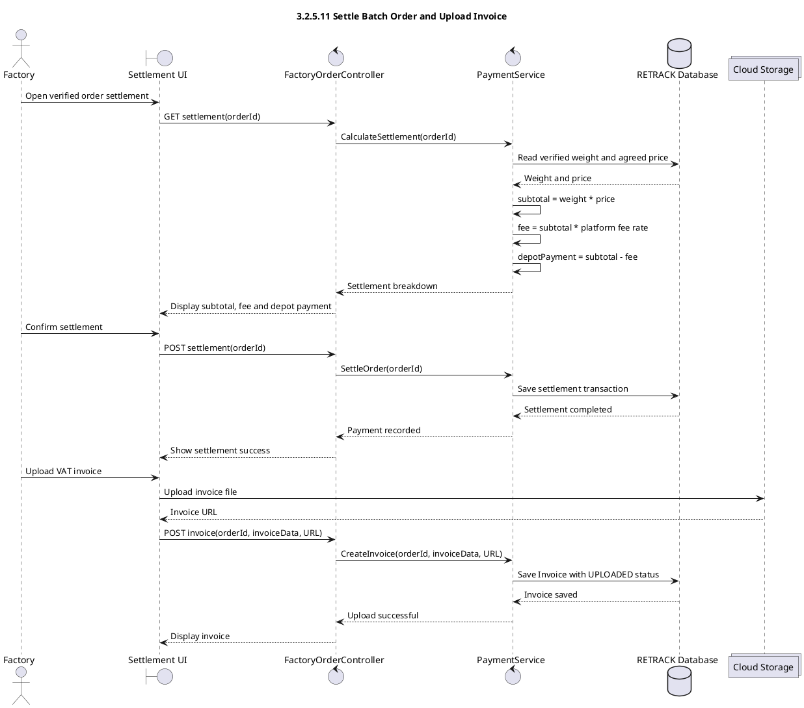

## 3.2.5.12 Rate and Manage Depot Partnership

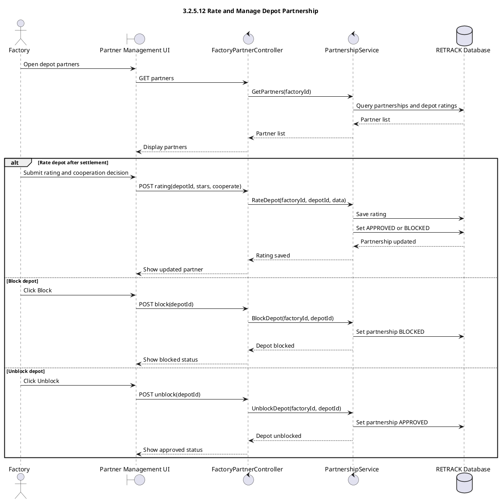

## 3.2.5.13 View and Generate EPR Certificate

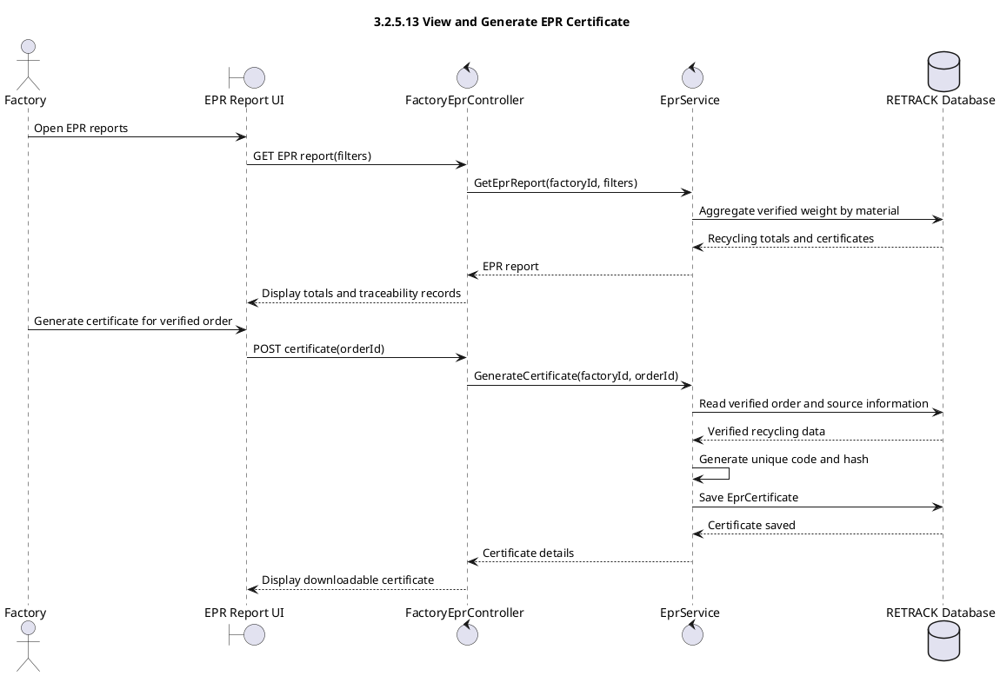
